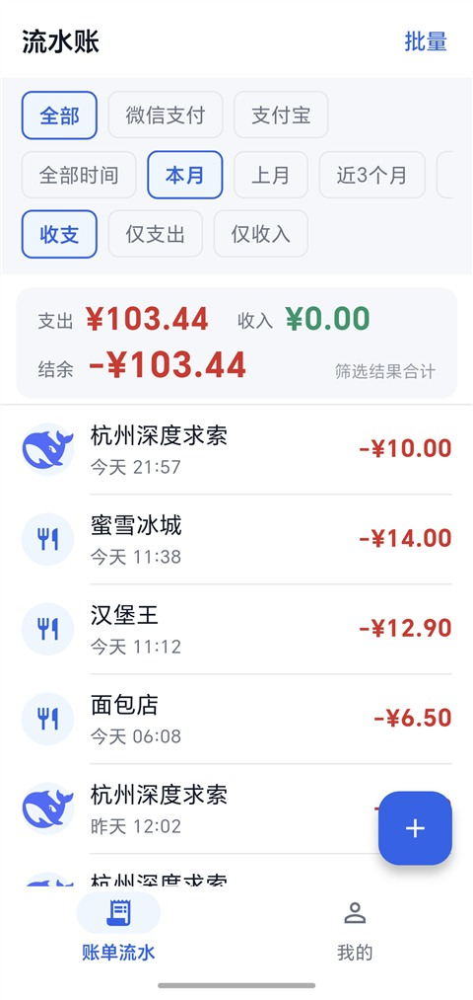
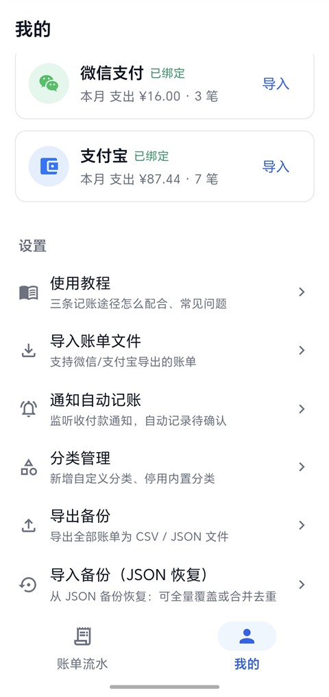
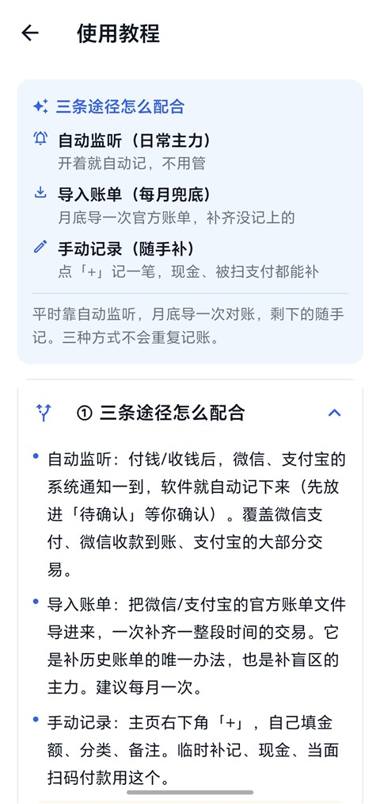

# 流水账

> 一款**纯本地**的记账 App：账单文件导入 + 通知自动记账 + 手动记录，数据只存在自己手机里。

Flutter 单代码库 → Android（正式使用）/ Web（开发调试）。**零第三方运行时插件**，原生部分全部用 Kotlin 自写。

| | |
|---|---|
| 🛠 **开发方式** | 本软件使用 **DeepSeek** 在 **DSH**（DeepSeek Harness）上完成开发 |
| 🔌 **无需联网** | 数据**仅储存在本地**，不上传、不需要注册账号；正式包不申请联网权限 |
| 📖 **怎么用** | 进入软件后打开 **我的 → 使用教程**，即可查看使用方法（三条记账途径怎么配合、常见问题） |

<p align="center">
  
  &nbsp;
  
  &nbsp;
  
  <br>
  <sub>账单流水 · 我的 · 使用教程</sub>
</p>

---

## 这是什么

「流水账」是一个**给自己用的、不联网的**记账工具。它不去对接微信/支付宝的开放平台（那是拿不到个人账单的），
而是走两条更朴素的路子：

1. **读系统通知** —— 你付钱/收钱时，微信和支付宝会发一条通知；App 通过 Android 官方的
   「通知使用权」拿到这条通知，在**本机**解析出金额、方向、时间，记成一笔账。
2. **读官方账单文件** —— 微信/支付宝都能导出对账单（CSV/XLSX），导入进来补齐历史与漏掉的交易。

两条路互补、自动去重，再加上一条「手动记一笔」兜底，日常基本不用操心。

> 适合谁：想要一个**不上传、不注册、不绑定**的记账工具，且主要用微信/支付宝的国内用户。
> 不适合谁：需要多人共享账本、多端云同步、自动同步银行卡流水的场景。

## 为什么不用现成的记账 App

- **不想把账单交给别人的服务器**：很多记账 App 要么云端存明细，要么靠短信/无障碍上传解析
- **不想注册账号、不想做实名/绑定**：本项目零账号体系，装完就能用
- **不想被"自动记账"要求重权限**：主流方案常依赖无障碍服务或短信读权限；本项目只用系统官方的
  `NotificationListenerService`（只读通知内容，且只认微信/支付宝两个包名）
- **导出对账这件事本来就该本地做**：账单文件在你手里，去重合并也在本机完成

## 三种记账途径怎么配合（核心设计）

| 途径 | 角色 | 覆盖 | 盲区 |
|---|---|---|---|
| 📡 **通知自动记账** | 日常主力 | 微信支付、微信收款到账、支付宝大部分收付款 | 见下方盲区清单 |
| 📥 **导入账单文件** | 每月兜底 | 微信/支付宝官方导出的 CSV / XLSX，补历史、补盲区 | 需手动导出一次（约 1 分钟） |
| ✍️ **手动记录** | 随手补 | 被扫支付、现金、临时补记 | 需要你自己动手 |

**平台盲区（App 内「使用教程」也会直说）**：这些场景**微信/支付宝本身不发通知**，任何靠通知的方案都记不到：

- 支付宝「被扫」付款（商家扫你的付款码）
- 微信主动转账/发红包给对方、微信群里收发红包
- 手机离线、通知被系统拦截、App 被「强行停止」时

→ 解决办法：**每月导一次官方账单**，或当场手动补一笔。

## 它是怎么工作的

```
微信/支付宝发通知
   ↓
NotifyListenerService（系统授权后由系统唤起，App 不必常驻前台）
   → 按包名认领 + 标题特征过滤（微信「微信支付」/ 含"到账·收款"；支付宝「交易提醒」）
   → 取出 标题/正文/到达时刻，先落到本地队列文件（App 没运行也不丢）
   ↓
Flutter 侧（启动或回前台时补拉队列）
   → 纯 Dart 解析器：无效词拦截 → 正文多数决判方向 → 锚定正则提金额 → 尽量提取对方
   → 指纹去重（账户 + 方向 + 金额 + ±1 分钟）
   → 记为「待确认」
   ↓
主页顶部横幅「有 N 条待确认」→ 待确认页
   单条 ✓ 确认 / 编辑（补商户·分类）/ 删除，或批量 / 全部确认
   ↓
正式账单流（列表、筛选、统计、导出全自动覆盖）
```

导入官方账单时，两侧会对账：库内**没有官方单号**的记录，按「同账户 + 同方向 + 同金额 + ±5 分钟」
与导入条目配对 → 跳过重复导入，并把**官方单号回填**到原记录（此后永久走单号去重）。

## 快速上手（入门提示）

### 第 1 步：安装

- 从 [Releases](../../releases) 下载 `流水账-vX.Y.Z.apk`（arm64 + 32 位 ARM 通用包）
- 手机设置里允许"安装未知来源应用"，然后安装
- 首次安装后桌面出现蓝底白色钱包图标

### 第 2 步：开启「通知自动记账」（三步，只做一次）

1. 打开 App → **我的 → 通知自动记账** → 打开顶部开关
   → 按提示跳系统设置，给「流水账」授权 **通知使用权**（系统级开关，Android 官方机制）
2. 同一个页面打开 **后台保活（推荐）**
   → 通知栏会常驻一条"正在监听收付款通知"的提示（低重要度，不响不亮）
3. 去系统设置里允许 **自启动 / 后台运行**（各品牌路径不同：
   华为/荣耀在「应用启动管理」，小米在「自启动」，OPPO/vivo 在「自启动 / 后台运行」）

> 做完这三步就可以正常用手机了，**不需要一直开着 App**。
> 从最近任务里划掉 App **不影响记账**；只有在系统设置里点了「强行停止」才会暂停监听，
> 重新打开 App 会自动恢复。

### 第 3 步：确认它真的在工作

- 进 **我的 → 通知自动记账**，顶部状态条应显示绿色「**监听正常**」
- 显示异常时：点「立即修复监听」；仍不行就把系统的通知使用权开关关掉再打开一次
- 之后正常消费一笔，主页会出现「有 1 条待确认」

### 日常使用建议

| 频率 | 做什么 |
|---|---|
| 平时 | 不用管，通知自动记；有「待确认」时点进主页横幅确认一下 |
| 每月初 | 导出上个月官方账单 → **我的 → 导入账单文件** → 选账户 → 选文件 → 确认（自动去重） |
| 随时 | 被扫支付/现金 → 主页右下角「+」手动记一笔 |
| 偶尔 | **我的 → 导出备份**（JSON），换机或误删时用「导入备份」恢复 |

### 常见问题

- **为什么有的消费没记上？** 大概率落在上面「平台盲区」里，用导入或手动补即可。
- **会不会重复记账？** 不会。通知之间按指纹判重；导入按官方单号判重；两侧交叉时用指纹桥合并。
- **数据会上传吗？** 不会。正式包**没有申请联网权限**，数据存在应用私有目录，且关闭了系统云备份。
- **换手机怎么办？** 旧机导出 JSON → 传到新机 → 新机「导入备份」恢复（合并去重或全量覆盖）。
- **待确认一直不处理会怎样？** 可以一直放着；堆到 20 条以上时，超过两天的会自动入账为「未分类」。

## 功能

- 记账主体：收支列表 / 筛选（账户·时间跨度·收支）/ 汇总（收入·支出·结余）/ 增删改 / 批量操作
- 通知自动记账全链路：原生 `NotificationListenerService` 采集 → 标题特征过滤 → 队列落盘 →
  Flutter 解析入库 → 待确认页单条/批量/全部确认 → 正式账单
- 可靠性：监听服务自愈重绑（组件 toggle）、前台保活服务、开机自启、健康自检（发探测通知回读队列）
- 分类管理：内置分类停用/启用、自定义分类（名称 + 图标，支持图片图标）
- 数据：本地 JSON 持久化、导出 CSV/JSON、JSON 备份恢复（合并去重 / 全量覆盖）、待确认治理
- 隐私：`allowBackup=false`，release 不申请联网权限，通知只在本机解析
- 内置「使用教程」页：讲清三条途径怎么配合与各自盲区（真机上可直接看）

## 技术要点

- **解析器与编排纯 Dart**：Web 模拟面板与 Android 原生监听共用同一条链路，端到端可测
- **零插件**：文件选择/保存用 `ACTION_OPEN_DOCUMENT` / `ACTION_CREATE_DOCUMENT`（SAF），
  持久化用 MethodChannel 取私有目录 + `dart:io`，避免引入任何 pub 插件
- **金额以分为单位**（`int amountCents`），展示层才格式化，杜绝浮点误差
- **去重双保险**：导入按官方单号；通知按"账户+方向+金额+±1 分钟"指纹；
  两侧交叉时用 **±5 分钟指纹桥**把通知记录与官方单号配对并回填单号（此后永久单号去重）
- **title-only 方向判定**：通知渠道无法区分支付与聊天（实测同渠道），因此方向只由正文词表多数决，
  平局一律拒收（宁缺毋滥），解析不了的原文进「无法解析日志」

## 目录结构

```
lib/
├── data/            RecordStore（记录/查询/治理）、CategoryStore（分类配置）
├── models/          Record / Account / Category ...
├── pages/           账单流水 / 我的 / 记一笔 / 待确认 / 导入 / 分类管理 / 通知设置 / 使用教程
├── services/
│   ├── notify/      通知解析器、入库编排、样本库、队列补拉、平台通道封装
│   ├── storage/     存储抽象（Web localStorage / Android 私有目录文件 / 内存）
│   └── ...          账单解析、导出、备份恢复、文件选择/保存
└── widgets/         账户徽标、分类图标等

android/app/src/main/kotlin/com/liushuizhang/app/
    MainActivity.kt            三个 MethodChannel：lsz_storage / lsz_notify / lsz_file
    NotifyListenerService.kt   通知监听（包名过滤 + 标题特征过滤 + 队列落盘）
    KeepAliveService.kt        前台保活服务
    BootReceiver.kt            开机自启

test/                测试（解析器 / 去重 / 导入 / 备份 / UI / 分类 / 通知全链路）
```

## 构建与运行

```bash
flutter pub get

# 开发（Web）
flutter run -d chrome

# 正式包（Android，arm64 + 32 位 ARM 通用包）
flutter build apk --release --target-platform android-arm64,android-arm
```

签名：在 `android/` 下放置 `key.properties`（`storePassword` / `keyAlias` / `keyPassword`）并配置
`signingConfig` 即可；**密钥文件已在 `.gitignore` 中排除，请勿入库**。

> 提示：首次构建 release 需要 Android NDK（AGP 用它带的 `llvm-strip` 裁掉引擎调试符号，
> 否则 APK 会从 ~34MB 膨胀到 300MB+）。国内可从镜像装：
> `https://mirrors.cloud.tencent.com/AndroidSDK/android-ndk-r28c-windows.zip`

## 测试

```bash
flutter analyze     # 期望：No issues found
flutter test        # 期望：全绿
```

测试样本为**脱敏后的真实格式**（列顺序、时间/金额格式、掩码位数、单号长度均保留），
因此格式回归能力不受影响。

## 隐私

- 正式包不申请 `INTERNET` 权限，数据不联网
- 账单数据存于应用私有目录；`allowBackup=false` + `dataExtractionRules` 拒绝系统云备份/换机迁移
- 通知内容仅在本机解析，不接任何外部服务
- 只用系统官方的通知监听机制，不使用无障碍服务、不读短信

## 已知限制

- 依赖微信/支付宝**发送系统通知**的行为，平台不发通知的交易无法自动记录（见上文盲区）
- 国产 ROM 需用户一次性授权：通知使用权 + 自启动/后台运行白名单（App 内「使用教程」有引导）
- 仅 Android 为正式目标平台，Web 端用于开发调试
- 暂无深色模式 / 多端同步 / 银行卡自动同步

## 许可

本项目采用 [MIT License](LICENSE)。

## 免责声明

本项目为个人自用工具，与微信、支付宝及其关联公司无任何关系。
请遵守相关平台的服务条款，导出的账单数据仅用于个人记账。
